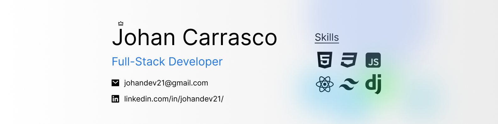

# Hi there! I'm Johan Carrasco 👋

I'm an aspiring Full Stack Developer from Chile, with a solid foundation in Frontend development and currently expanding my expertise by focusing on Django.

  
About Me

  
  I'm passionate about self-directed learning and enjoy picking up new skills on my own. I’m currently exploring Full Stack development.
  
  - **Name**: Johan Carrasco
  - **Age**: 20
  - **Location**: Rancagua, Chile
  - **Pronouns**: he/him

  
Technologies I Know

  - **Programming Languages**: Python, JavaScript
  - **Frontend**: HTML, CSS, React, Tailwind, Bootstrap, Sass
  - **Backend**: Django, Django Rest Framework
  - **Databases**: MySQL, MongoDB
  - **Version Control**: Git, GitHub
  - **Server Knowledge**: Basic knowledge of Windows Server and Linux

  
Technologies I'm learning and planning to Learn

  - **Next.js** (I plan to learn)
  - **React Native** (I plan to learn)

  
Get in Touch

  - **LinkedIn**: [Johan Carrasco](https://www.linkedin.com/in/johan-carrasco-493a85319/)
  - **Email**: [johandev21@gmail.com](mailto:johandev21@gmail.com)
  - **Portfolio**: [johan2160.github.io/Portfolio](https://johan2160.github.io/Portfolio/)

